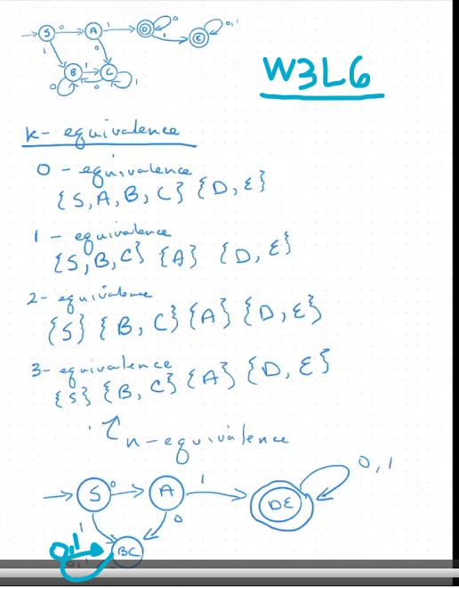
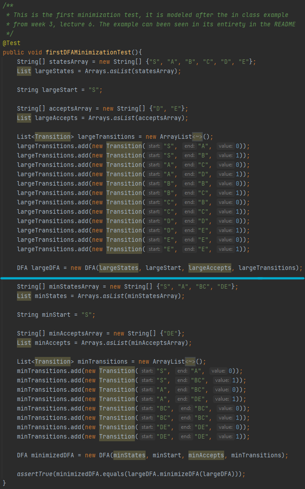
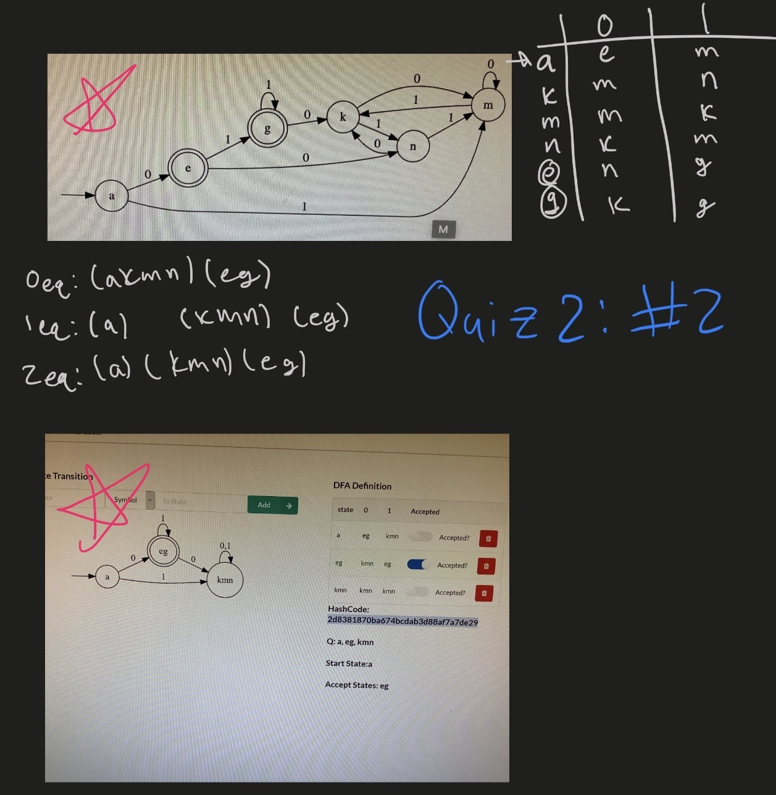
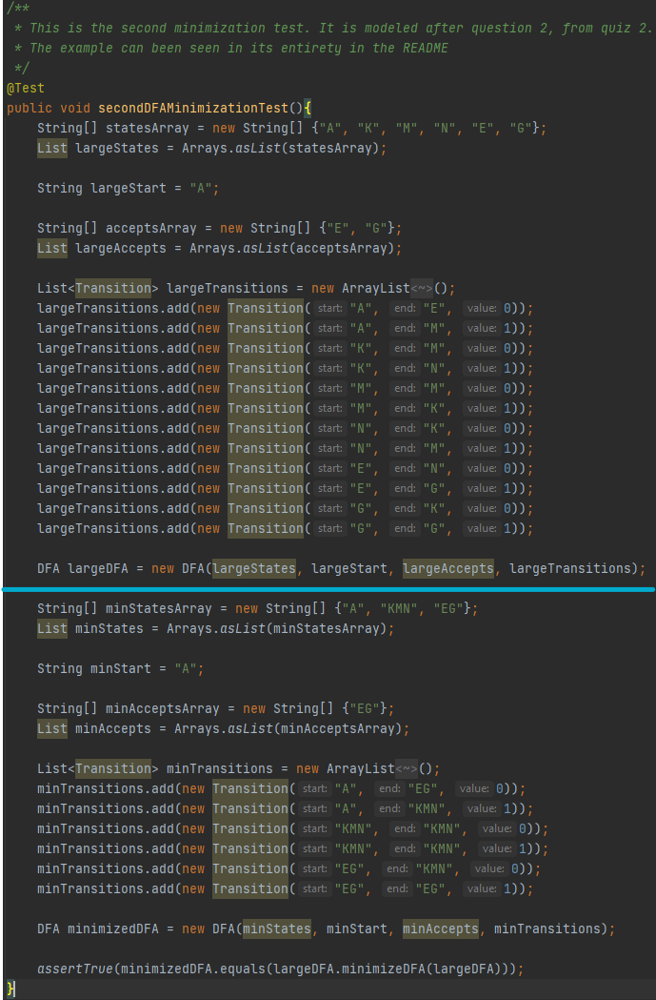

## Theory of Computation Final Project: 
## LMU Fall 2020 CMSI 385-02: Prof. Masahji C. Stewart
 
 ---
## Firstly, A litter to the professor:
Dear Professor,

Here we are at the end of the semester. This year has been a personal hell for me. We already talked earlier in the semester so I will spare you most the the details. I really appreciated your kindness throughout the semester and I thought you made a great professor. From talking to my friends who have had you in they past, they loved you too. Overall, that made me feel even worse for struggling in your class when I knew you would be so able to help, but I just couldn't ask. I was able to see a psychiatrist, and unfortunately it made things a lot worse at first. I am only now starting to get a little bit better. I know I have a bad grade in your class, and a lot of work missing, and that nothing is going to make those assignment magically appear. However I want you to know that I was able to pay attention and try to get things done a lot better after our meeting earlier this semester, even if I don't have much to show for it. Most importantly though, I put why whole heart in this final project to give you a really quality piece of work that is worth a great grade and I hope it will convince you to pass me with a D. 

I talked to Dr. Toal earlier in the semester and I know this class isn't available next semester and so theres no way I can take it in the spring. It's also an upper division course, so I cant take it anywhere other than LMU. You would know more about this than me, but during one of his classes Dr. Toal said that this class was getting combined into compilers and another class to make two 4 unit classes instead of one 3 unit Theory of Computation class, so I might not even be able to take it at LMU at all. Unfortunately, these thoughts also only made it more difficult to try to get a handle on things. If there is theory next year, I still would not be able to take the spring semester because I need at least a D in theory to go into compilers, and without being able to do that I wouldn't be a full time student and I would lose my scholarships. I would have to take another leave of absence just to take theory next fall and then my course load for what would have been spring 2021, in spring 2022 making my stay in college 6 years long. I can't afford that financially, among so many other reasons. But enough whining. I know these aren't your problems. I am just praying that this project is worthy of passing me with a D, and I believe it is. Regardless, I wanted to thank you for your positivity throughout the semester and may this awful year be over soon. I just want to move on and focus on becoming mentally and physically healthier and graduating college. Next semester my medications should have normalized and I can start over on a healthy routine and focus on my talk therapy sessions when I feel myself slipping.

I know I wasn't able to meet with you, but I have done [quiz corrections for quiz 2](Quiz2corrections.pdf) (DFA minimization), and I have included those corrections in this repo. I hope that the success of this project is enough for you to evaluate my understanding and count those corrections toward my grade.

Lastly, I hope you and your family, friends, and relatives have an amazing Christmas. May God bless you.

Sincerely,

-Seth Cassellius

---

## K-Equivalence DFA Minimizer written in Java by Seth Cassellius
### To minimize complete, binary DFAs

My project consists of three classes: DFA, Transition, and MinimizationTester.

1. The DFA: The DFA is a class I made to model a DFA so that I have something to minimize. I could not find any reference DFA.json files online so I had nothing to test against and thus had to create the DFA from scratch for my project. I know that makes it hard for you to test my code so I have written very intensive tests for you to look over. The DFA has a the complete set of states, the start state, the set of accept states, and the set of transitions. When I feed data into the DFA constructor, it is tested thoroughly for accuracy. All data is cleaned and processed before it the DFA is constructed to ensure that a complete and valid DFA is built. I go in depth into this in the Javadoc comments in my code.

2. The Transition: The Transition is a 3-Tuple I made to store the transitions in between states of the DFA. It has a start state, an end state, and a 0 or a 1 for its transition value.

3. The MinimizationTester: This is the tester file for my project. The tests are written in JUnit and can be run however you normally choose to run JUnit tests. In case you are unfamiliar with running them, I have included a video of me running the tests as proof. I use IntelliJ Idea in the video to run the tests. The tests thoroughly check the construction of my DFA for accuracy as a complete and valid DFA, as well as making sure that I can correctly minimize two examples from your class.
---

## The Minimization Tests

As I listed above, I was unable to find a way to support DFA input in JSON format, so I did my best to test my program for you. I hope this is more than enough to prove the success of my project. You are more than welcome to write your own tests, although I know you are very busy. In any case I have been very complete with my Javadoc comments so you should find it easy to understand. 

1. Test one is the DFA you used to teach us K-Equivalence minimization with in lecture number six, of week three. Below is the DFA in its entirety, solved from start to finish.

    

    Here we have my code implementation for that DFA. The first half shows the DFA in its original state, and the bottom half is the code for the correctly minimized DFA as shown in the explanation from class.

    

2. Test two is modeled after the second problem from quiz number two. I chose this problem because I originally got it correct on the quiz, so it is a great example of a correctly minimized DFA. Below is my work from the quiz showing the problem and how to minimize it.

    

    And here is my coded implementation. Once again the un-optimized DFA is on top, and the minimized DFA is on the bottom.

    

## Running the tests

Here is the video of me explaining a little bit about my project, and running the JUnit tests for you.

[Video about the Project](TheoryFinalProject.mp4) <--- If you are having trouble with the link, the video is in the images folder.

---

## Retrospective

Overall I think I produced a great project and I am honestly very proud of it. But it was put together in a limited amount of time and there are things that I think I could have done better.

* Could further work on refining my data structures to make less work for myself and the program as it is running. Would also improve the clarity of my code.

* I would have loved to implement additional and more complex tests but alas I do not have enough time.

* I realized that I made some mistakes such as not privatizing the data sets of my DFA and those should in fact have getter methods and not be readily accessible by the program. 

* The program is very clunky overall and could use some minimization itself, but I did my best to abstract methods when possible and keep it clean in the time provided.

---

Once again, thank you for everything, and I hope you have a wonderful Christmas break.

Sincerely,

-Seth Cassellius